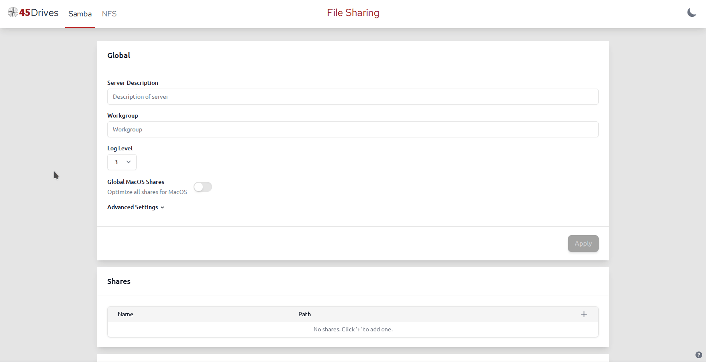

# cockpit-file-sharing
A Cockpit plugin for managing Samba and NFS shares.


## Features
### Samba
- Manage global setings
    - Server description, workgroup, log level
    - Any other settings can be configured through the *Advanced Settings* dropdown
    - One-click advanced configuration global MacOS share optimization
- Manage shares
    - Create, edit, and remove shares
    - Manage allow-list of valid users and groups
    - One-click advanced configuration for Windows ACLs, shadow copy, MacOS share optimization, and audit logging
    - Create non-existing share path from UI
    - Manage Linux-side share path permissions
    - Ceph-specific options
        - Quota
        - Layout pool
        - Cephfs remount for properly reporting quota to client
    - Export and import of configuration (same format as `/etc/samba/smb.conf`)  

User and group management was removed from cockpit-file-sharing in favour of managing Samba users through the new [cockpit-identities](https://github.com/45drives/cockpit-identities) plugin. Install that plugin to manage groups and Samba passwords.
### NFS
- Create, edit, and remove shares
- Manage individual client settings
- Export and import of configuration (same format as `/etc/exports`)

# Installation
Recommended: [cockpit-identities](https://github.com/45drives/cockpit-identities) for managing Samba password.
## Ubuntu 20.04
### From 45Drives Repo (Recommended, Ubuntu 20.04 only)
```bash
curl -sSL https://repo.45drives.com/setup | sudo bash
sudo apt install cockpit-file-sharing
```
### Direct from .deb
Installing this way may work for other versions of Ubuntu and Debian, but it is unsupported. You won't get automatic updates this way.
```bash
curl -LO https://github.com/45Drives/cockpit-file-sharing/releases/download/v3.2.5/cockpit-file-sharing_3.2.5-1focal_all.deb
sudo apt install ./cockpit-file-sharing_3.2.5-1focal_all.deb
```
## Rocky 8
### From 45Drives Repo (Recommended, Rocky 8 only)
```bash
curl -sSL https://repo.45drives.com/setup | sudo bash
sudo dnf install cockpit-file-sharing
```
### Direct from .rpm
Installing this way may work for other versions of Rocky/Centos/RHEL/Fedora/etc, but it is unsupported. You won't get automatic updates this way.
```bash
# dnf or yum
sudo dnf install https://github.com/45Drives/cockpit-file-sharing/releases/download/v3.2.5/cockpit-file-sharing-3.2.5-1.el8.noarch.rpm
```
## Generic Installation
1. Install Dependencies
```bash
# debian-like
cockpit
attr
coreutils
libc-bin
nfs-kernel-server
samba
samba-common-bin
systemd
winbin
# RHEL-like
cockpit
attr
coreutils
glibc-common
nfs-utils
samba-common-tools
samba-winbind-clients
system
```
2. Download pre-built archive and install
```bash
curl -LO https://github.com/45Drives/cockpit-file-sharing/releases/download/v3.2.5/cockpit-file-sharing_3.2.5_generic.zip
unzip cockpit-file-sharing_3.2.5_generic.zip
cd cockpit-file-sharing_3.2.5_generic
# no need to run `make` first, the plugin is pre-built
sudo make install
```
# Usage
## Samba Management Tab
The Samba tab in cockpit-file-sharing is a front end UI for the [net conf](https://linux.die.net/man/8/net) registry used by Samba. Any shares manually configured in `/etc/samba/smb.conf` won't show up in the UI, but they can be imported with the `Import` button at the bottom of the page. Your Samba configuration file must have `include = registry` in the `[global]` section, which can be automatically configured in one click in the UI.
### Adding a Share
Simply click the `+` in the top right of the shares list, fill out the required fields, and click `Confirm`.
#### Fields/Settings
* Share Name - Unique name for the share
* Share Description - Optional description for the share
* Path - The path to share out from the server
* Valid Users/Groups
    * Allow-lists for users and groups
    * By default, any user or group is allowed
* Guest Ok - Allow accessing share with no password, privileges mapped to `guest account` (default=`nobody`)
* Read Only - Disallow creation/modification of files/directories
* Browsable - Controls whether this share is seen in the list of available shares in a net view and in the browse list
* Windows ACLs - Administer share permissions from Windows, sets the following advanced settings
    ```ini
    map acl inherit = yes
    acl_xattr:ignore system acls = yes
    vfs objects = acl_xattr
    ```
* Shadow Copy - Expose per-file snapshots to users, sets the following advanced settings
    * ZFS:
        ```ini
        vfs objects = shadow_copy2
        shadow:snapdir = .zfs/snapshot
        shadow:sort = desc
        shadow:format = %Y-%m-%d-%H%M%S
        ```
    * Ceph:
        ```ini
        vfs objects = ceph_snapshots
        ```
* MacOS Share - Optimize share for MacOS, sets the following advanced settings
    ```ini
    vfs objects = catia fruit streams_xattr
    fruit:encoding = native
    fruit:metadata = stream
    fruit:zero_file_id = yes
    fruit:nfs_aces = no
    ```
* Audit Logs - Turn on audit logging, sets the following advanced settings
    ```ini
    vfs objects = full_audit
    full_audit:priority = notice
    full_audit:facility = local5
    full_audit:success = connect disconnect mkdir rmdir read write rename
    full_audit:failure = connect
    full_audit:prefix = %u|%I|%S
    ```
* Advanced Settings - Dropdown for configuring any other share parameters. See [smb.conf(5)](https://www.samba.org/samba/docs/current/man-html/smb.conf.5.html) for a full list of parameters.
### Editing a Share
Click the pencil icon at the right side of the share list entry to edit the share. Settings are the same as creating a share, except you cannot change the share name or path.
### Removing a Share
Click the trash can icon at the right side of the share list entry, then click `Yes` in the confirmation prompt to delete the share. This only removes the share definition from Samba, it does **not** remove any files.
### User and Group Management
User and group management was removed from cockpit-file-sharing, in favour of implementing it in a separate plugin, [cockpit-identities](https://github.com/45drives/cockpit-identities)
### SeDiskOperatorPrivilege
This section was removed from cockpit-file-sharing.
### Import Shares from `/etc/samba/smb.conf`
To allow cockpit-file-sharing to manage existing shares defined in `/etc/samba/smb.conf`, click the `Import configuration from /etc/samba/smb.conf` button at the bottom of the page.
It will confirm before overwriting your current share settings, and prompt to replace the content of `/etc/samba/smb.conf` with only `include = registry` in the `[global]` section,
backing up the original content to `/etc/samba/smb.conf.bak.~1~`.

## NFS Management Tab
The NFS tab in cockpit-file-sharing is a graphical way of editing the contents of `/etc/exports.d/cockpit-file-sharing.exports`, which has the same syntax as `/etc/exports`.
### Adding a Share
Much like the Samba tab, simply click the `+` in the top right of the shares list to start adding an NFS export. The only settings are the path to the directory you want to share, and a list of clients consiting of a host and a comma-separated list of export options for that host. See [exports(5)](https://linux.die.net/man/5/exports) for options and machine name formats for the host field.
### Editing a Share
Click the pencil icon at the right side of the share list entry to edit the share. Settings are the same as creating a share.
### Removing a Share
Click the trash can icon at the right side of the share list entry, then click `Yes` in the confirmation prompt to delete the share. This only removes the share definition from Samba, it does **not** remove any files.
### Import Shares (Exports) from `/etc/exports`
To allow cockpit-file-sharing to manage existing shares defined in `/etc/exports`, do the following (as root):
1. Create a backup copy of exports: `cp /etc/exports /etc/exports.bak`
2. Move exports to cockpit-file-sharing managed location: `mv /etc/exports /etc/exports.d/cockpit-file-sharing.exports`
3. Create an empty default exports file: `touch /etc/exports`
