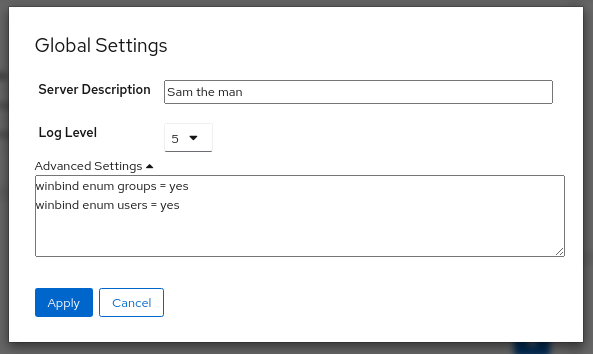

# cockpit-file-sharing
A Cockpit plugin to easily manage samba and NFS file sharing.

## Features
* Add and edit Samba shares.
* Full control of Samba Share parameters
* Auto populate parameters with commonly used settings
* Edit global Samba config
* Manage Samba users and their groups
* Add and remove groups.
* Set SeDiskOperator Privileges
* Add and remove NFS sharing with full control of permissions and client IPs

## Samba Manager


### Adding Shares


### Removing Shares


### Editing Global Settings


### Adding Groups to User


### Creating Groups


### Creating SeDiskOperator Privileges


## NFS Manager


### Adding a NFS


### Removing a NFS


# Installation
## From Source
1. Ensure dependencies are installed: `cockpit`, `samba`, `nfs-kernel-server`.
1. `$ git clone https://github.com/45Drives/cockpit-file-sharing.git`
1. `$ cd cockpit-file-sharing`
1. `# make install`
## From 45Drives Repositories
### Ubuntu
1. Import GPG Key
```sh
wget -qO - http://images.45drives.com/repo/keys/aptpubkey.asc | sudo apt-key add -
```
2. Add 45drives.list
```sh
cd /etc/apt/sources.list.d
sudo wget http://images.45drives.com/repo/debian/45drives.list
```
3. Uncomment second line in sources.list.d/45drives.list
```sh
vim /etc/apt/sources.list.d/45drives.list
sudo apt update
```
4. Install Package
```sh
sudo apt install cockpit-file-sharing
```
