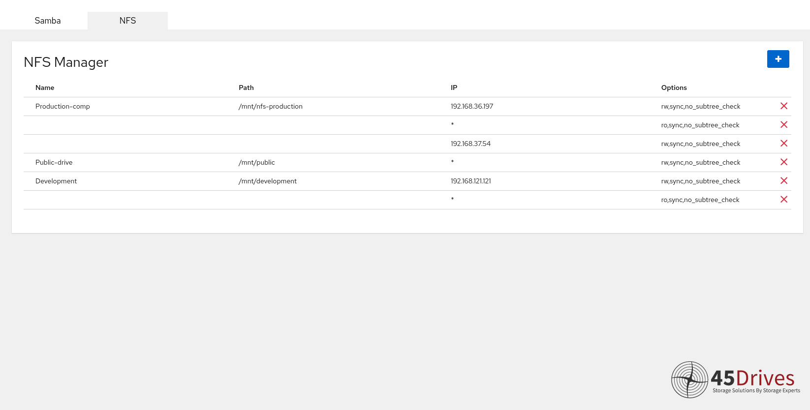

# cockpit-file-sharing
A Cockpit plugin to easily manage samba and NFS file sharing.

## Table of Contents
* [General](#general)
    * [Features](#features)
    * [Samba Manager Screenshot](#samba-manager-screenshot)
    * [NFS Manager Screenshot](#nfs-manager-screenshot)
* [Installation](#installation)
    * [From 45Drives Repo](#from-45drives-repo)
        * [Ubuntu](#ubuntu)
        * [Rocky](#rocky)
        * [CentOS 7](#centos-7)
    * [From Source](#from-source)
* [Samba Manager](#samba-manager)
    * [Add Share](#add-share)
        * [Advanced Settings](#advanced-settings)
    * [Removing Shares](#removing-shares)
    * [Editing Global Settings](#editing-global-settings)
    * [Group Management](#group-management)
    * [User Management](#user-management)
    * [SeDiskOperatorPrivilege](#sediskopperatorprivilege)
* [NFS Manager](#nfs-manager) 
    * [Adding Exports](#adding-exports)
    * [Editing Exports](#editing-exports)
    * [Removing an Export](#removing-an-export)
    * [Removing a Client](#removing-a-client)
    * [Export File Syntax](#export-file-syntax)

## General

### Features
* Add and edit Samba shares
* Full control of Samba Share parameters
* Auto populate parameters with commonly used settings
* Edit global Samba config
* Manage Samba users and their groups
* Add and remove groups
* Set SeDiskOperator Privileges
* Add and remove NFS sharing with full control of permissions and client IPs

### Samba Manager Screenshot


### NFS Manager Screenshot


## Installation
### From 45Drives Repo
#### Ubuntu
```bash
$ wget -qO - http://images.45drives.com/repo/keys/aptpubkey.asc | apt-key add -
$ curl -o /etc/apt/sources.list.d/45drives.list http://images.45drives.com/repo/debian/45drives.list
$ apt update
$ apt install cockpit-file-sharing
```
#### Rocky
```bash
$ curl -o /etc/yum.repos.d/45drives.repo http://images.45drives.com/repo/centos/45drives-centos.repo
$ dnf clean all && dnf makecache
$ dnf install cockpit-file-sharing
```
#### CentOS 7
```bash
$ curl -o /etc/yum.repos.d/45drives.repo http://images.45drives.com/repo/centos/45drives-centos.repo
$ yum clean all && yum makecache
$ yum install cockpit-file-sharing
```

### From Source
Ensure dependencies are installed: `cockpit`, `python3`, `samba`, `nfs-kernel-server`.
```bash
$ git clone https://github.com/45Drives/cockpit-file-sharing.git
$ cd cockpit-file-sharing
$ make install
```

## Samba Manager
Samba manager is used to setup samba shares in an efficient manner.

The main component to this manager is the "Share Management" card. This is used to edit and add samba shares. To add a share you simply click the "+" button.

### Add Share


You have full ability to customize your share the way you want it. Looking through the options in the menu, a lot are self explanatory, such as share name and description, however the rest of the options can be complicated. Down below are the options and their descriptors.

* Path - The path to the directory on the server you would like to share
* Windows ACLs - Checking the box adds parameters that enables access control list on the share
* Valid Users - Users who can access the share
* Valid Groups - Groups that can access the share
* Guest Ok - Checking this box makes the Samba Share not require a password to access
* Browsable - Controls whether the share is seen a list of available shares in net view 

### Advanced Settings


Under the advanced settings tab there is an input box. You can enter any extra Samba settings you want into this box. We have implemented templates that will auto populate the input box with popular settings many users use. Down below is a description of these auto populate settings.

* Shadow Copy - Utilizes microsoft's shadow copy service which creates backup copies or snapshots of files within the samba share
* MacOS Share - Allows shares to be seen on MacOS
* Audit Logs - Adds ability to record events and changes on the samba share

For any more info on settings that can be inserted into this area, please checkout the samba config documentation, https://www.samba.org/samba/docs/current/man-html/smb.conf.5.html. 

### Removing Shares


Removing shares is as simple as clicking the "X" beside the share you would like to delete, then confirm that you want to remove the share.


### Editing Global Settings


In the global settings, you can change the description of the server as well as the amount of logs that are viewable. Much like the advanced samba settings, there is a input section to add any parameter you would like to set for all your shares on your server.


### Group Management


Adding a group is as simple as pressing the "+" button, name the group, then confirm. Removing the group is just as easy, click the "X" next to the group you would like to delete, then confirm.


### User Management


Managing Samba Users in file sharing is as easy as can be. First you select the user to manage, you can then add as many groups as you want to the user and also delete groups from a user if needed!


Changing the password of a samba user is possible through the "Set Samba Password" button. You can remove the password by clicking the "Remove Password" button, then confirm.


### SeDiskOperatorPrivilege


You can add privileges by clicking on the "+" button. You will be greeted with the menu above, you can set the group of the privilege and you can add a username and password. Remove privileges by clicking the "X" besides the privilege.

## NFS Manager

 
### Adding Exports
You can add a NFS export by clicking "+" button. Within the export add menu, you have the options for export name and path. There is also a section for clients. You may add a client by clicking the "+" button. This will give you another set of Client Name, IP and Permissions. The IP is who can access the particular export and the permissions are the rules set for that IP on the export. By adding multiple clients you can have multiple IP address accessing the same export, all having different permissions.

We have set the default IP to "*". This means that anyone can have access to that export. We have set defaults of permissions to rw,sync,no_tree_subcheck. If you want to enter your own permissions, do so by separating the options by commas (See out defaults for example). Check https://linux.die.net/man/5/nfs to see a full list of available options/permissions. 

### Editing Exports
If you feel the need to change an export that is already added, you can click on the settings icon to the far right of the export. Clicking edit will bring you to the edit modal where you can change everything about your pre-exisitng export.

### Removing an Export
If you would like to remove a whole export, click on the settings icon, then click on remove. This will permently remove the whole export. This WILL NOT however remove the path that it is attached to.

### Removing a Client
If you like to a specific client from an export, go into the edit modal of the export. From the edit modal you can press the red "X" by the individual clients you would like to remove.

### Export File Syntax
NFS Manger uses the file /etc/exports.d/cockpit-file-sharing.exports to add exports to the NFS-server. In order for the UI portion to work there needs to be a certain syntax to the exports file.

\# Name: Name of Export  
\# Clients: Client 1 Name, Client 2 Name  
"/path/to/export" client-1-ip(client,1,permissions) client-2-ip(client,2,permissions) 

If any export does not follow this syntax, the UI will throw an error!